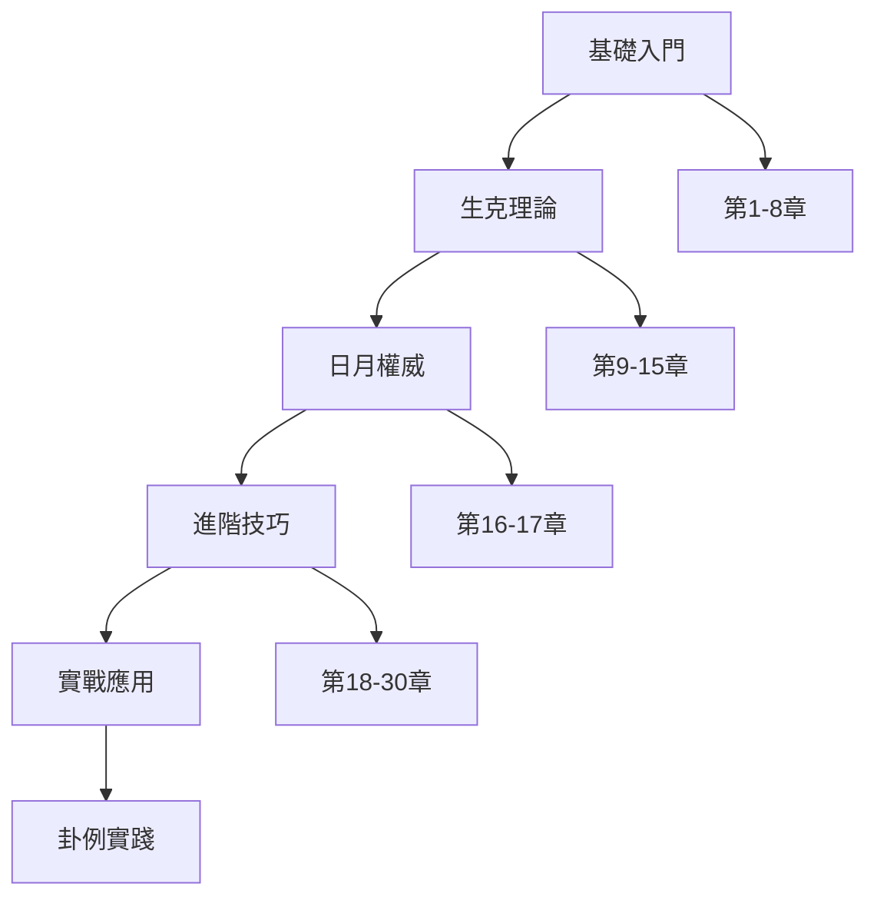

# 📖 增刪卜易章節學習路徑圖

> [!NOTE] 關於本路徑圖
> 本文檔提供系統化的學習路徑建議,幫助不同程度的學習者規劃最佳學習順序。

## 🎯 學習路徑總覽



---

## 🌱 初學者路徑 (建議學習時間: 2-3個月)

### 第一階段:基礎概念 (第1-8章)

#### 必修章節 (按順序)

1. **[[theory/01_八卦章|第1章 八卦章]]** ⭐⭐⭐⭐⭐
   - **學習重點**: 八卦基本物象、家庭成員對應
   - **前置知識**: 無
   - **學習時間**: 1-2天
   - **配套術語**: 無特定術語
   - **實踐建議**: 熟記八卦符號和基本屬性

2. **[[theory/02_卦象圖章|第2章 卦象圖章]]** ⭐⭐⭐⭐⭐
   - **學習重點**: 搖卦方法、六十四卦畫法
   - **前置知識**: 第1章
   - **學習時間**: 2-3天
   - **配套術語**: 無
   - **實踐建議**: 實際搖卦練習,熟悉陰陽動靜標記

3. **[[theory/03_八宮章|第3章 八宮章]]** ⭐⭐⭐⭐
   - **學習重點**: 六十四卦宮位歸屬、五行屬性
   - **前置知識**: 第1-2章
   - **學習時間**: 3-4天
   - **配套術語**: 無
   - **實踐建議**: 使用[[reference/六十四卦速查表|六十四卦速查表]]輔助記憶

4. **[[theory/04_渾天甲子章|第4章 渾天甲子章]]** ⭐⭐⭐
   - **學習重點**: 卦爻納地支規律
   - **前置知識**: 第1-3章
   - **學習時間**: 2-3天
   - **配套術語**: 無
   - **實踐建議**: 配合速查表練習納支

5. **[[theory/05_六親歌章|第5章 六親歌章]]** ⭐⭐⭐⭐⭐
   - **學習重點**: 六親定義和取法
   - **前置知識**: 第1-4章
   - **學習時間**: 3-5天
   - **配套術語**: [[glossary/父母爻|父母爻]]、[[glossary/兄弟爻|兄弟爻]]、[[glossary/子孫爻|子孫爻]]、[[glossary/妻財爻|妻財爻]]、[[glossary/官鬼爻|官鬼爻]]
   - **實踐建議**: 熟記六親歌訣,多做練習

6. **[[theory/06_世應章|第6章 世應章]]** ⭐⭐⭐⭐⭐
   - **學習重點**: 世爻應爻的定義和安法
   - **前置知識**: 第1-5章
   - **學習時間**: 2-3天
   - **配套術語**: [[glossary/世爻|世爻]]、[[glossary/應爻|應爻]]
   - **實踐建議**: 練習快速定位世應

7. **[[theory/07_動變章|第7章 動變章]]** ⭐⭐⭐⭐
   - **學習重點**: 動爻變化規則
   - **前置知識**: 第1-6章
   - **學習時間**: 2-3天
   - **配套術語**: [[glossary/動爻|動爻]]
   - **實踐建議**: 理解陰陽互變原理

8. **[[theory/08_用神章|第8章 用神章]]** ⭐⭐⭐⭐⭐
   - **學習重點**: 用神取法、用神有根無根
   - **前置知識**: 第1-7章
   - **學習時間**: 3-5天
   - **配套術語**: [[glossary/用神|用神]]
   - **實踐建議**: 練習不同占事的用神取法

#### 第一階段總結
- **總學習時間**: 約3-4週
- **核心成果**: 能夠完整起卦、排卦、定六親、找用神
- **檢驗標準**: 能獨立完成一個完整卦象的基本排列
- **推薦卦例**: [[cases/求財/case_002_占求財_動不為空|占求財_動不為空]]

---

### 第二階段:生克理論 (第9-15章)

#### 必修章節 (按順序)

9. **[[theory/09_元神忌神仇神章|第9章 元神忌神仇神章]]** ⭐⭐⭐⭐⭐
   - **學習重點**: 四神關係、生克連環
   - **前置知識**: 第1-8章
   - **學習時間**: 3-5天
   - **配套術語**: [[glossary/元神|元神]]、[[glossary/忌神|忌神]]、[[glossary/仇神|仇神]]
   - **實踐建議**: 畫圖理解四神關係
   - **推薦卦例**: [[cases/六親/case_001_占父近病|占父近病]]

10. **[[theory/10_元神忌神衰旺章|第10章 元神忌神衰旺章]]** ⭐⭐⭐⭐
    - **學習重點**: 元神忌神的旺衰判斷
    - **前置知識**: 第9章
    - **學習時間**: 2-3天
    - **配套術語**: 同第9章
    - **實踐建議**: 結合月令判斷旺衰

11. **[[theory/11_五行相生章|第11章 五行相生章]]** ⭐⭐⭐⭐⭐
    - **學習重點**: 五行生扶路徑
    - **前置知識**: 第9-10章
    - **學習時間**: 3-4天
    - **配套術語**: [[glossary/化生|化生]]、[[glossary/回頭生|回頭生]]
    - **實踐建議**: 使用[[reference/五行生克速查表|五行生克速查表]]
    - **推薦卦例**: [[cases/疾病/case_022_占女痘_暗動救治|占女痘_暗動救治]]

12. **[[theory/12_五行相克章|第12章 五行相克章]]** ⭐⭐⭐⭐⭐
    - **學習重點**: 五行克制路徑
    - **前置知識**: 第11章
    - **學習時間**: 3-4天
    - **配套術語**: [[glossary/化克|化克]]、[[glossary/回頭克|回頭克]]
    - **實踐建議**: 對比生克兩章,理解陰陽平衡

13. **[[theory/13_克處逢生章|第13章 克處逢生章]]** ⭐⭐⭐⭐
    - **學習重點**: 絕處逢生的判定
    - **前置知識**: 第11-12章
    - **學習時間**: 2-3天
    - **配套術語**: 無特定術語
    - **實踐建議**: 理解生克轉化的關鍵時機

14. **[[theory/14_動靜生克章|第14章 動靜生克章]]** ⭐⭐⭐⭐⭐
    - **學習重點**: 動靜權力等級
    - **前置知識**: 第7章、第11-13章
    - **學習時間**: 3-5天
    - **配套術語**: 無特定術語
    - **實踐建議**: 理解"動者為先"的原則

15. **[[theory/15_動變生克沖合章|第15章 動變生克沖合章]]** ⭐⭐⭐⭐⭐
    - **學習重點**: 變爻的封閉作用
    - **前置知識**: 第7章、第14章
    - **學習時間**: 3-5天
    - **配套術語**: 回頭生克相關術語
    - **實踐建議**: 理解動爻變化的優先級

#### 第二階段總結
- **總學習時間**: 約4-5週
- **核心成果**: 掌握五行生克理論,能判斷卦象吉凶
- **檢驗標準**: 能分析簡單卦例的生克關係
- **推薦卦例**: [[cases/疾病/case_003_自占病_用神無根|自占病_用神無根]]

---

## 🌿 進階者路徑 (建議學習時間: 2-3個月)

### 第三階段:日月權威 (第16-17章)

16. **[[theory/16_月建章|第16章 月建章]]** ⭐⭐⭐⭐⭐
    - **學習重點**: 月建如天、旺衰氣數、月破辨別
    - **前置知識**: 第1-15章
    - **學習時間**: 5-7天
    - **配套術語**: [[glossary/月建|月建]]、[[glossary/月破|月破]]
    - **實踐建議**: 熟記十二月建,理解"月建如天"
    - **推薦卦例**: [[cases/功名/case_027_占將來有官_月破實破|占將來有官_月破實破]]

17. **[[theory/17_日辰章|第17章 日辰章]]** ⭐⭐⭐⭐⭐
    - **學習重點**: 六爻主宰、暗動日破、救月破
    - **前置知識**: 第16章
    - **學習時間**: 5-7天
    - **配套術語**: [[glossary/日辰|日辰]]、[[glossary/日破|日破]]、[[glossary/暗動|暗動]]
    - **實踐建議**: 理解日月同權的核心概念
    - **推薦卦例**: [[cases/疾病/case_014_占病_日旺月克|占病_日旺月克]]

#### 第三階段總結
- **總學習時間**: 約2-3週
- **核心成果**: 掌握日月權威,能精確判斷旺衰
- **檢驗標準**: 能準確判斷月破、日破、暗動
- **里程碑**: 這是從初學到進階的關鍵轉折點

---

### 第四階段:進階技巧 (第18-30章)

#### 核心章節 (建議優先學習)

18. **[[theory/26_旬空章|第26章 旬空章]]** ⭐⭐⭐⭐⭐
    - **學習重點**: 十旬空亡、動空靜空、旺空弱空
    - **前置知識**: 第16-17章
    - **學習時間**: 4-5天
    - **配套術語**: [[glossary/旬空|旬空]]、[[glossary/化空|化空]]
    - **實踐建議**: 熟記十旬空亡表
    - **推薦卦例**: [[cases/求財/case_008_占求財_旬空出空|占求財_旬空出空]]

19. **[[theory/19_六合章|第19章 六合章]]** ⭐⭐⭐⭐
    - **學習重點**: 地支六合、合起合絆
    - **前置知識**: 第1-17章
    - **學習時間**: 3-4天
    - **配套術語**: [[glossary/六合|六合]]、[[glossary/合起|合起]]、[[glossary/合絆|合絆]]、[[glossary/合住|合住]]
    - **實踐建議**: 使用[[reference/地支關係速查表|地支關係速查表]]
    - **推薦卦例**: [[cases/出行/case_018_占出門_合住不動|占出門_合住不動]]

20. **[[theory/20_六沖章|第20章 六沖章]]** ⭐⭐⭐⭐
    - **學習重點**: 地支六沖、沖散原理
    - **前置知識**: 第19章
    - **學習時間**: 3-4天
    - **配套術語**: [[glossary/六沖|六沖]]、[[glossary/沖散|沖散]]
    - **實踐建議**: 對比六合六沖,理解合散原理
    - **推薦卦例**: [[cases/婚姻/case_019_占悔婚_六沖變合|占悔婚_六沖變合]]

21. **[[theory/24_卦變生克墓絕章|第24章 卦變生克墓絕章]]** ⭐⭐⭐⭐⭐
    - **學習重點**: 化生化克化墓化絕
    - **前置知識**: 第11-12章
    - **學習時間**: 5-7天
    - **配套術語**: [[glossary/化生|化生]]、[[glossary/化克|化克]]、[[glossary/化墓|化墓]]、[[glossary/化絕|化絕]]、[[glossary/長生十二宮|長生十二宮]]
    - **實踐建議**: 重點理解化克的凶性
    - **推薦卦例**: [[cases/功名/case_023_代卜功名_化克絕卦|代卜功名_化克絕卦]]

22. **[[theory/29_進神退神章|第29章 進神退神章]]** ⭐⭐⭐⭐
    - **學習重點**: 進退神判斷、應期推算
    - **前置知識**: 第24章
    - **學習時間**: 4-5天
    - **配套術語**: [[glossary/進神|進神]]、[[glossary/退神|退神]]、[[glossary/化進神|化進神]]、[[glossary/化退神|化退神]]
    - **實踐建議**: 熟記十二地支進退表
    - **推薦卦例**: [[cases/功名/case_031_占鄉試_化進聯捷|占鄉試_化進聯捷]]

#### 補充章節 (可選學習)

23. **[[theory/18_六神章|第18章 六神章]]** ⭐⭐⭐
    - **學習重點**: 六神配日干、輔助判斷
    - **前置知識**: 第1-17章
    - **學習時間**: 2-3天
    - **配套術語**: [[glossary/青龍|青龍]]、[[glossary/白虎|白虎]]、[[glossary/朱雀|朱雀]]、[[glossary/玄武|玄武]]、[[glossary/勾陳|勾陳]]、[[glossary/騰蛇|騰蛇]]
    - **重要提示**: 六神為附合之神,不可單以六神斷吉凶

24. **[[theory/21_三刑章|第21章 三刑章]]** ⭐⭐
    - **學習重點**: 三刑種類、實際應用有限
    - **前置知識**: 第19-20章
    - **學習時間**: 1-2天
    - **配套術語**: [[glossary/三刑|三刑]]、[[glossary/六害|六害]]、[[glossary/自刑|自刑]]
    - **重要提示**: 野鶴老人數十年只驗一卦,不可過分重視

25. **[[theory/22_暗動章|第22章 暗動章]]** ⭐⭐⭐⭐
    - **學習重點**: 暗動與日破的區別
    - **前置知識**: 第17章
    - **學習時間**: 3-4天
    - **配套術語**: [[glossary/暗動|暗動]]
    - **實踐建議**: 理解"福來而不知,禍來而不覺"
    - **推薦卦例**: [[cases/疾病/case_022_占女痘_暗動救治|占女痘_暗動救治]]

26. **[[theory/23_動散章|第23章 動散章]]** ⭐⭐⭐
    - **學習重點**: 動爻沖散的條件
    - **前置知識**: 第20章、第22章
    - **學習時間**: 2-3天
    - **配套術語**: [[glossary/動散|動散]]
    - **重要提示**: 休囚者間有沖散,千百中之一二

27. **[[theory/25_反伏章|第25章 反伏章]]** ⭐⭐⭐
    - **學習重點**: 反吟伏吟的判斷
    - **前置知識**: 第20章
    - **學習時間**: 2-3天
    - **配套術語**: [[glossary/反吟伏吟|反吟伏吟]]
    - **實踐建議**: 理解反復與憂鬱的區別

28. **[[theory/27_月破章|第27章 月破章]]** ⭐⭐⭐⭐
    - **學習重點**: 月破種類、應期判斷
    - **前置知識**: 第16章
    - **學習時間**: 3-4天
    - **配套術語**: [[glossary/月破|月破]]
    - **實踐建議**: 區分實破、合破、動破、靜破

29. **[[theory/28_飛伏神章|第28章 飛伏神章]]** ⭐⭐⭐⭐
    - **學習重點**: 用神不上卦的處理
    - **前置知識**: 第8章
    - **學習時間**: 4-5天
    - **配套術語**: [[glossary/飛神|飛神]]、[[glossary/伏神|伏神]]
    - **實踐建議**: 理解飛伏生克關係

30. **[[theory/30_隨鬼入墓章|第30章 隨鬼入墓章]]** ⭐⭐⭐⭐
    - **學習重點**: 真墓假墓判斷
    - **前置知識**: 第24章
    - **學習時間**: 3-4天
    - **配套術語**: [[glossary/化墓|化墓]]
    - **實踐建議**: 研究經典案例"三墓中狀元"
    - **推薦卦例**: [[cases/功名/case_036_占會試_三墓中狀元|占會試_三墓中狀元]]

#### 第四階段總結
- **總學習時間**: 約6-8週
- **核心成果**: 掌握所有進階技巧,能分析複雜卦象
- **檢驗標準**: 能獨立分析功名、趨避等複雜卦例

---

## 🎓 實戰者路徑 (建議學習時間: 持續實踐)

### 第五階段:實戰應用

#### 專題研究

1. **應期判斷專題**
   - 學習工具: [[reference/應期判斷速查表|應期判斷速查表]]
   - 重點章節: 第16-17章、第26-29章
   - 推薦卦例: 
     - [[cases/行人/case_028_占父何日歸_破而逢合|占父何日歸_破而逢合]]
     - [[cases/疾病/case_022_占女痘_暗動救治|占女痘_暗動救治]]

2. **趨避之法專題**
   - 重點卦例: [[cases/趨避/README|趨避類索引]]
   - 核心案例: [[cases/趨避/case_047_占索債_避凶得救|占索債_避凶得救]]
   - 學習重點: 如何根據卦象調整行動時機

3. **多占之法專題**
   - 重點章節: 第26章 (旬空章)
   - 推薦卦例:
     - [[cases/疾病/case_030_占父病_三卦雷同|占父病_三卦雷同]]
     - [[cases/求財/case_024_占求財_多占合斷|占求財_多占合斷]]
     - [[cases/功名/case_040_占南行_四卦催行|占南行_四卦催行]]

4. **長期追蹤專題**
   - 推薦卦例:
     - [[cases/壽元/case_046_占壽元_二十年驗|占壽元_二十年驗]]
     - [[cases/功名/case_029_占後遇功名_平生凶吉|占後遇功名_平生凶吉]]

---

## 📊 章節依賴關係圖

### 核心依賴鏈

```
第1-4章 (基礎排卦)
    ↓
第5-6章 (六親世應)
    ↓
第7-8章 (動變用神)
    ↓
第9-10章 (四神關係)
    ↓
第11-15章 (生克理論)
    ↓
第16-17章 (日月權威) ← 關鍵轉折點
    ↓
第18-30章 (進階技巧) - 可靈活選擇順序
```

### 並行學習建議

以下章節可以並行學習:
- 第19章 (六合) + 第20章 (六沖)
- 第26章 (旬空) + 第27章 (月破)
- 第28章 (飛伏) + 第30章 (入墓)
- 第22章 (暗動) + 第23章 (動散)

---

## 🎯 學習檢查點

### 初學者檢查點 (完成第1-8章後)
- [ ] 能獨立完成搖卦、排卦
- [ ] 能正確安六親、定世應
- [ ] 能找出用神
- [ ] 理解基本的五行生克

### 進階者檢查點 (完成第9-17章後)
- [ ] 能判斷元神、忌神、仇神
- [ ] 能分析基本的生克關係
- [ ] 能判斷月破、日破、暗動
- [ ] 能進行簡單的吉凶判斷

### 實戰者檢查點 (完成第18-30章後)
- [ ] 能處理複雜的卦象變化
- [ ] 能準確判斷應期
- [ ] 能分析特殊格局
- [ ] 能獨立完成完整的卦例分析

---

## 💡 學習建議

### 對於初學者
1. **循序漸進**: 嚴格按照第1-17章的順序學習
2. **多做練習**: 每學完一章,至少分析2-3個相關卦例
3. **使用工具**: 善用速查表,不要死記硬背
4. **建立筆記**: 記錄學習心得和疑問

### 對於進階者
1. **重點突破**: 第16-17章是關鍵,務必深入理解
2. **靈活學習**: 第18-30章可根據興趣調整順序
3. **案例分析**: 每個章節至少分析5個相關卦例
4. **總結歸納**: 建立自己的判斷流程

### 對於實戰者
1. **專題研究**: 選擇感興趣的專題深入研究
2. **實踐驗證**: 實際占卜並記錄驗證結果
3. **經驗總結**: 建立自己的判斷經驗庫
4. **教學相長**: 嘗試教導他人,鞏固理解

---

## 📚 推薦學習組合

### 組合1: 快速入門 (1個月)
- 第1-8章 (基礎)
- 第9-12章 (生克)
- 第16-17章 (日月)
- 簡單卦例實踐

### 組合2: 系統學習 (3個月)
- 第1-17章 (完整基礎)
- 第19-20章 (合沖)
- 第24章 (卦變)
- 第26章 (旬空)
- 中等難度卦例實踐

### 組合3: 全面掌握 (6個月)
- 全部30章理論
- 所有50個術語
- 50個卦例分析
- 專題研究

---

## 🔗 相關資源

- 📖 [[000_增刪卜易_學習地圖|返回學習地圖]]
- 📚 [[README|專案README]]
- 🔍 [[連結修復完成報告|連結檢查報告]]
- 📊 [[術語擴充完成報告|術語擴充報告]]

---

*最後更新: 2026-01-28*  
*文檔版本: v1.0*
